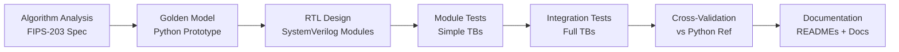
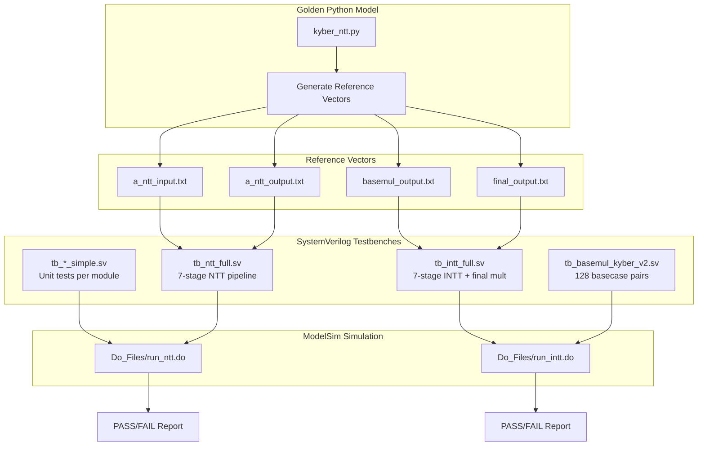

<div align="center">
  <h1>Phase 1: Standalone RTL Architecture</h1>
  <p>
    <strong>SystemVerilog RTL · Python Golden Model · NTT-based Post-Quantum Cryptography</strong>
  </p>
  <p>
    <em>Part of the <a href="../README.md">CRYSTALS-Kyber Hardware Accelerator</a> project</em>
  </p>
  <p>
    <a href="./Docs/Architecture.md"></a>
    <a href="./Docs/Repository_Structure.md"></a>
    <a href="./TB/README.md"></a>
  </p>
</div>

---

## Table of Contents

- [Table of Contents](#table-of-contents)
- [Overview](#overview)
- [Motivation](#motivation)
  - [Why Post-Quantum Cryptography?](#why-post-quantum-cryptography)
  - [Why Hardware?](#why-hardware)
- [Features](#features)
  - [Module Latency Summary](#module-latency-summary)
- [Architecture Overview](#architecture-overview)
- [Repository Structure](#repository-structure)
- [Repository Tree](#repository-tree)
- [Design Flow](#design-flow)
- [Verification Flow](#verification-flow)
- [Golden Model](#golden-model)
- [Research Papers](#research-papers)
- [Project Summary](#project-summary)
- [Getting Started](#getting-started)
  - [Prerequisites](#prerequisites)
  - [Simulate the NTT](#simulate-the-ntt)
  - [Generate Reference Vectors](#generate-reference-vectors)
- [Phase 2: Vortex GPGPU Integration](#phase-2-vortex-gpgpu-integration)
- [License and Acknowledgments](#license-and-acknowledgments)

---

## Overview

This repository contains a **hardware accelerator for CRYSTALS-Kyber polynomial multiplication**, implemented in SystemVerilog RTL. CRYSTALS-Kyber is a post-quantum key-encapsulation mechanism (KEM) selected by NIST for standardization.

The core operation accelerated is **polynomial multiplication in the ring Z_q[x]/(x^n + 1)**, performed via the **Number Theoretic Transform (NTT)** — the finite-field equivalent of the FFT. This reduces the complexity from O(n^2) to O(n log n).

All modules are fully pipelined, constant-time (side-channel resistant), and use shift-add-subtract arithmetic to eliminate DSP block dependencies. A Python golden model provides reference vectors for verification.

## Motivation

### Why Post-Quantum Cryptography?

Large-scale quantum computers — once realized — will break RSA, ECDSA, and ECDH using Shor's algorithm. CRYSTALS-Kyber is one of the leading post-quantum replacements, offering:

- **Security** against quantum and classical adversaries
- **Efficiency** in software and hardware
- **Practicality** with modest key sizes (< 1.2 KB for Kyber-512)

### Why Hardware?

- Many Kyber deployments will be in **embedded systems, IoT devices, FPGAs in cloud accelerators, and hardware security modules (HSMs)**
- Polynomial multiplication is the computational bottleneck (> 80% of execution time)
- A dedicated hardware accelerator provides **deterministic latency, energy efficiency, and physical security**

## Features

- **Complete NTT pipeline**: Forward NTT, basecase multiplication, inverse NTT, final scaling
- **Constant-time arithmetic**: Bit-mask-based conditional reduction prevents timing side channels
- **Multiplier-free datapath**: All constant multiplications use shift-add-subtract sequences
- **Fully pipelined**: Every module registers inputs and outputs; deterministic latency
- **Modular design**: Each operation is a standalone, reusable SystemVerilog module
- **Cross-validated**: Python golden model generates reference vectors for all testbenches
- **Documented pipeline depths**: Every module specifies exact cycle latency

### Module Latency Summary

| Module | Latency | Throughput |
|--------|---------|------------|
| `barrett_reduction_kyber` | 1 cycle | 1/cycle |
| `barrett_reduction_kyber_wide` | 1 cycle | 1/cycle |
| `modq` | 1 cycle | 1/cycle |
| `ct_butterfly` | 2 cycles | 1/cycle |
| `gs_butterfly` | 2 cycles | 1/cycle |
| `basemul_kyber_v2` | 3 cycles | 1 pair/cycle |
| `kyber_final_mult` | 1 cycle | 1/cycle |

## Architecture Overview

```
                     ┌──────────────────────────────────────┐
                     │   NTT Pipeline for Kyber Poly Mul    │
                     ├──────────────────────────────────────┤
  Polynomial A ─────►│  ct_butterfly × 127  (7 stages)      │──► NTT(A)
  Polynomial B ─────►│  ct_butterfly × 127  (7 stages)      │──► NTT(B)
                     │                                      │
  NTT(A), NTT(B) ───►│  basemul_kyber_v2 × 64               │──► C (NTT domain)
                     │                                      │
  C (NTT domain) ───►│  gs_butterfly × 127  (7 stages)      │──► INTT(C)
                     │                                      │
  INTT(C) ──────────►│  kyber_final_mult × 256  (×n⁻¹)      │──► Final Result
                     └──────────────────────────────────────┘
```

For a detailed architectural description, see [Docs/Architecture.md](./Docs/Architecture.md).

## Repository Structure

```
HW-design/
├── Design/                  # RTL source files (SystemVerilog)
│   ├── modq.sv              # Conditional reduction
│   ├── barrett_reduction_kyber.sv       # 24-bit Barrett
│   ├── barrett_reduction_kyber_wide.sv  # 36-bit Barrett
│   ├── ct_butterfly.sv      # Cooley-Tukey butterfly
│   ├── gs_butterfly.sv      # Gentleman-Sande butterfly
│   ├── basemul_kyber_v2.sv  # Basecase multiplication
│   └── kyber_final_mult.sv  # Final scaling
├── TB/                      # Verification environment
│   ├── Do_Files/            # ModelSim simulation scripts
│   └── Ref/                 # Reference vectors (text/hex)
├── Golden-python-model/     # Python reference implementation
├── Papers/                  # Curated research literature
├── Docs/                    # Architecture and design documentation
└── README.md                # This file
```

For a detailed breakdown of each directory's role and how they interact, see [Docs/Repository_Structure.md](./Docs/Repository_Structure.md).

## Repository Tree

```
HW-design/
├── Design/
│   ├── barrett_reduction_kyber.sv
│   ├── barrett_reduction_kyber_wide.sv
│   ├── basemul_kyber_v2.sv
│   ├── ct_butterfly.sv
│   ├── gs_butterfly.sv
│   ├── kyber_final_mult.sv
│   └── modq.sv
├── TB/
│   ├── Do_Files/
│   │   ├── run_intt.do
│   │   └── run_ntt.do
│   ├── Ref/
│   │   ├── a_ntt_input.txt
│   │   ├── a_ntt_output.hex
│   │   ├── a_ntt_output.txt
│   │   ├── b_ntt_input.txt
│   │   ├── b_ntt_output.hex
│   │   ├── b_ntt_output.txt
│   │   ├── basemul_output.hex
│   │   ├── basemul_output.txt
│   │   ├── final_output.txt
│   │   └── intt_output.txt
│   ├── tb_barrett_simple.sv
│   ├── tb_basemul_kyber_v2.sv
│   ├── tb_basemul_simple.sv
│   ├── tb_ct_butterfly_simple.sv
│   ├── tb_gs_butterfly_simple.sv
│   ├── tb_intt_full.sv
│   ├── tb_kyber_final_mult.sv
│   ├── tb_kyber_final_mult_simple.sv
│   ├── tb_modq_simple.sv
│   └── tb_ntt_full.sv
├── Golden-python-model/
│   └── kyber_ntt.py
├── Papers/
│   ├── CRYSTALS - Kyber, a CCA-secure module-lattice-based KEM.pdf
│   ├── CRYSTALS-Kyber, Algorithm Specifications And Supporting Documentation (version 3.02).pdf
│   ├── CRYSTALS-Kyber, Algorithm Specifications And Supporting Documentation(version 3.01).pdf
│   ├── Accelerating Number Theoretic Transformations for Bootstrappable Homomorphic Encryption on GPUs.pdf
│   ├── Area-time efficient pipelined number theoretic transform for CRYSTALS-Kyber.pdf
│   ├── Breaking DPA-protected Kyber via the pair-pointwise multiplication.pdf
│   ├── Designing Efficient and Flexible NTT Accelerators.pdf
│   ├── Efficient Accelerator for NTT-based Polynomial Multiplication.pdf
│   ├── Explicit cost analysis of Toom-4 multiplication for incomplete NTT in lattice-based cryptography.pdf
│   ├── Faster AVX2 optimized NTT multiplication for Ring-LWE lattice cryptography.pdf
│   ├── Formally Verified Number-Theoretic Transform.pdf
│   ├── Fully Homomorphic Encryption Accelerators.pdf
│   ├── High-Speed NTT-based Polynomial Multiplication Accelerator for CRYSTALS-Kyber Post-Quantum Cryptography.pdf
│   ├── Incompleteness in Number-Theoretic Transforms, New Tradeoffs and Faster Lattice-Based Cryptographic Applications.pdf
│   ├── Kyber - Resources.html
│   ├── NTT Multiplication for NTT-unfriendly Rings.pdf
│   ├── Number Theoretic Transform and Its Applications in Lattice-based Cryptosystems.pdf
│   ├── Optimized Quantum-Resistant Cryptosystem, Integrating Kyber-KEM with Hardware TRNG on Zynq Platform.pdf
│   ├── Speeding up the Number Theoretic Transform for Faster Ideal Lattice-Based Cryptography.pdf
│   ├── Two Algorithms for Fast GPU Implementation of NTT.pdf
│   └── Zero-Value Filtering for Accelerating Non-Profiled Side-Channel Attack on Incomplete NTT based Implementations of Lattice-based Cryptography.pdf
├── Docs/
│   ├── Architecture.md
│   ├── Module_Interactions.md
│   └── Repository_Structure.md
└── README.md
```

## Design Flow

The design follows a structured pipeline from algorithm specification to RTL verification:



For the complete design flow description, see [Docs/Repository_Structure.md](./Docs/Repository_Structure.md).

## Verification Flow



For the complete verification guide, see [TB/README.md](./TB/README.md).

## Golden Model

The Python golden model (`Golden-python-model/kyber_ntt.py`) implements:

- **Forward NTT**: Cooley-Tukey butterfly with 7 stages and stage-by-stage tracking
- **Inverse NTT**: Gentleman-Sande butterfly with 7 stages plus final n⁻¹ scaling
- **Basecase multiplication**: Degree-1 polynomial multiplication for all 64 pairs
- **Full polynomial multiplication**: NTT + basecase + INTT (complete Kyber operation)
- **Naive O(n²) multiplication**: For cross-validation of NTT-based results
- **Reference vector export**: JSON and JavaScript formats for external tools

The model generates all reference vectors used by the SystemVerilog testbenches, ensuring algorithmic consistency between Python and RTL.

For details, see [Golden-python-model/README.md](./Golden-python-model/README.md).

## Research Papers

The `Papers/` directory contains a curated collection of academic literature organized by topic. The collection covers:

| Category | Focus |
|----------|-------|
| Kyber Specification | NIST standards and algorithm specifications |
| NTT Theory | Mathematical foundations and algorithmic variants |
| Hardware Accelerators | ASIC/FPGA NTT designs |
| FPGA Implementations | Platform-specific optimizations |
| GPU Implementations | Parallel NTT on GPUs |
| Security | Side-channel analysis and countermeasures |
| Formal Verification | Mathematically verified NTT implementations |

For the guided reading guide with paper importance, contributions, and recommended order, see [Papers/README.md](./Papers/README.md).

## Project Summary

The `Docs/` directory contains comprehensive technical documentation:

| Document | Content |
|----------|---------|
| [Architecture.md](./Docs/Architecture.md) | System architecture, NTT pipeline, design philosophy, module hierarchy |
| [Module_Interactions.md](./Docs/Module_Interactions.md) | Module dependency graph, data flow, signal interfaces |
| [Repository_Structure.md](./Docs/Repository_Structure.md) | Directory roles, file naming, path dependencies |

## Getting Started

### Prerequisites

- **Simulator**: ModelSim / QuestaSim (for `.do` scripts), or any SystemVerilog simulator
- **Python**: 3.8+ (for golden model and reference vector generation)
- **Make** (optional, for workflow automation)

### Simulate the NTT

```bash
# From the TB/ directory
cd TB/

# Run the NTT testbench
vsim -do Do_Files/run_ntt.do

# Run the INTT testbench
vsim -do Do_Files/run_intt.do
```

### Generate Reference Vectors

```bash
# From the Golden-python-model/ directory
cd Golden-python-model/
python kyber_ntt.py
```

This regenerates all reference vectors in `TB/Ref/`.

## Phase 2: Vortex GPGPU Integration

This is Phase 1 of a two-phase project. For the next phase — integrating these RTL modules into the Vortex RISC-V GPGPU with custom ISA extensions and performance evaluation — see the [Vortex-PQC-integration README](../Vortex-PQC-integration/README.md).

## License and Acknowledgments

For repository-wide license information, please refer to the [repository root README](../README.md).
