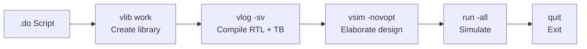

# Do_Files — ModelSim Simulation Scripts (Phase 1)

> Part of [Phase 1: Standalone RTL Architecture](../../README.md) — automation scripts for the verification flow.

## Purpose

This directory contains ModelSim/QuestaSim `.do` scripts that automate the compilation and simulation of the CRYSTALS-Kyber RTL modules and their testbenches. Each script handles the complete simulation workflow: library creation, compilation, elaboration, simulation, and exit.

## Workflow



## Scripts

### `run_ntt.do`

Compiles and simulates the **forward NTT** pipeline using the Cooley-Tukey butterfly.

**Files compiled:**
```
barrett_reduction_kyber.sv   — Barrett reduction (24-bit)
modq.sv                      — Conditional reduction
ct_butterfly.sv              — Cooley-Tukey butterfly
tb_ntt_full.sv               — Full NTT testbench (7 stages, 256 coefficients)
```

**Execution:**
```bash
# From the TB/ directory:
vsim -do Do_Files/run_ntt.do
```

**Expected output:** After 381+ simulation cycles, displays PASS/FAIL for all 256 NTT output coefficients.

### `run_intt.do`

Compiles and simulates the **inverse NTT** pipeline using the Gentleman-Sande butterfly, followed by the final scaling multiplication.

**Files compiled:**
```
barrett_reduction_kyber.sv   — Barrett reduction (24-bit)
modq.sv                      — Conditional reduction
gs_butterfly.sv              — Gentleman-Sande butterfly
tb_intt_full.sv              — Full INTT testbench (7 stages + final scaling)
```

**Note:** `kyber_final_mult.sv` is also compiled through its inclusion in `tb_intt_full.sv`.

**Execution:**
```bash
# From the TB/ directory:
vsim -do Do_Files/run_intt.do
```

**Expected output:** After simulation, displays PASS/FAIL for all 256 final multiplication outputs.

## Adding a New DO Script

To create a simulation script for a new testbench:

1. Create `<test_name>.do` in this directory
2. Use `vlib work` to create/clear the library
3. Use `vlog -sv <file>.sv` for each source file (RTL first, then testbench)
4. Use `vsim -novopt <tb_module> -t 1ns` to elaborate
5. Use `run -all` to simulate
6. Use `quit` to exit

**Template:**

```tcl
# run_<test>.do — ModelSim compile & simulate script for <test>
# Usage: vsim -do run_<test>.do

vlib work

# RTL sources (in dependency order)
vlog -sv <lowest_level_module>.sv
vlog -sv <mid_level_module>.sv
vlog -sv <top_module>.sv

# Testbench
vlog -sv tb_<test>.sv

# Simulate
vsim -novopt tb_<test> -t 1ns
run -all
quit
```

## Tips

- Source files are referenced relative to the working directory from which `vsim` is launched, not relative to the `.do` file location. Run `vsim` from the `TB/` directory, not from `TB/Do_Files/`.
- The `-sv` flag is needed for SystemVerilog support.
- The `-novopt` flag disables optimization, which helps with debugging.
- Add `-t 1ns` to set the simulation time resolution.
- For waveform debugging, add `add wave *` before `run -all`.
