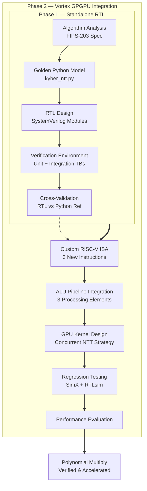
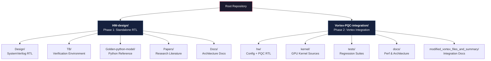
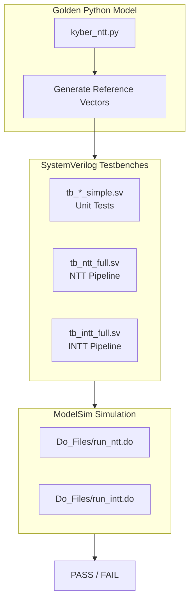
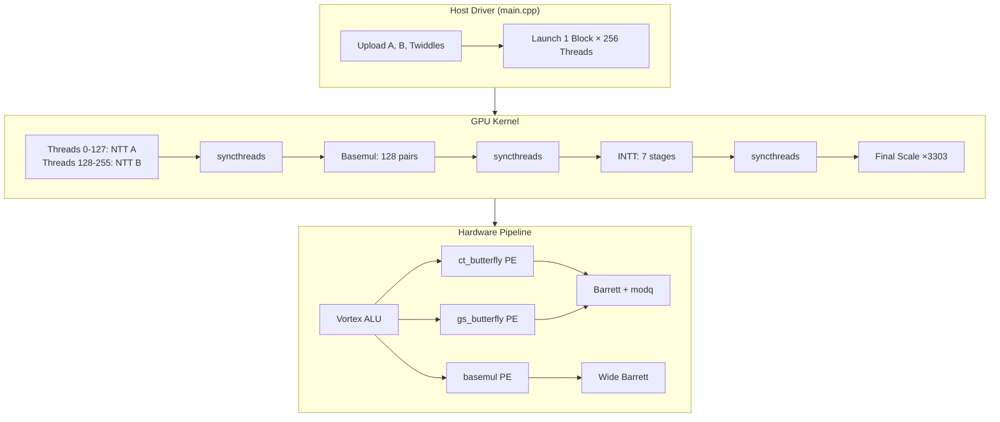

<div align="center">
  <h1>CRYSTALS-Kyber: Hardware Accelerator for NTT-based Polynomial Multiplication</h1>
  <p>
    <strong>SystemVerilog RTL · Python Golden Model · Vortex GPGPU Integration · Post-Quantum Cryptography</strong>
  </p>
  <p>
    <a href="./LICENSE"></a>
    
    
    
    
  </p>
</div>

---



---

## Table of Contents

- [Table of Contents](#table-of-contents)
- [Project Overview](#project-overview)
- [Motivation](#motivation)
  - [Why Post-Quantum Cryptography?](#why-post-quantum-cryptography)
  - [Why Hardware Acceleration?](#why-hardware-acceleration)
  - [Why GPGPU Integration?](#why-gpgpu-integration)
- [Project Goals](#project-goals)
- [Engineering Workflow](#engineering-workflow)
- [Repository Organization](#repository-organization)
- [Project Phases](#project-phases)
  - [Phase 1: Standalone RTL Architecture](#phase-1-standalone-rtl-architecture)
  - [Phase 2: Vortex GPGPU Integration](#phase-2-vortex-gpgpu-integration)
- [High-Level Architecture](#high-level-architecture)
  - [Standalone NTT Pipeline](#standalone-ntt-pipeline)
  - [Vortex GPGPU Integration](#vortex-gpgpu-integration)
- [Documentation Guide](#documentation-guide)
  - [Module Latency Summary](#module-latency-summary)
  - [Performance Summary (Phase 2)](#performance-summary-phase-2)
- [Getting Started](#getting-started)
  - [Phase 1: Run the Standalone NTT Simulation](#phase-1-run-the-standalone-ntt-simulation)
  - [Phase 2: Run the Vortex Integration Test](#phase-2-run-the-vortex-integration-test)
- [Repository Navigation](#repository-navigation)
  - [Quick Links](#quick-links)
  - [RTL Module Reference](#rtl-module-reference)
- [Future Work](#future-work)
- [License](#license)

---

## Project Overview

This repository presents the complete engineering journey of designing, verifying, and integrating a **hardware accelerator for CRYSTALS-Kyber (ML-KEM) polynomial multiplication** — from standalone RTL modules to a full GPGPU integration.

The core operation accelerated is **polynomial multiplication in the ring Z_q[x]/(x^n + 1)** via the **Number Theoretic Transform (NTT)**, reducing complexity from O(n²) to O(n log n). The accelerator spans two major phases: (1) standalone RTL design with Python golden model validation, and (2) integration into the open-source Vortex RISC-V GPGPU architecture with custom ISA extensions, kernel support, and cycle-accurate performance evaluation.

All modules are fully pipelined, constant-time (side-channel resistant), and use shift-add-subtract arithmetic to eliminate DSP block dependencies.

## Motivation

### Why Post-Quantum Cryptography?

Large-scale quantum computers — once realized — will break RSA, ECDSA, and ECDH using Shor's algorithm. CRYSTALS-Kyber, standardized by NIST as **ML-KEM** (FIPS-203), is one of the leading post-quantum replacements, offering security against both quantum and classical adversaries with efficient key sizes.

### Why Hardware Acceleration?

Polynomial multiplication is the computational bottleneck of Kyber, consuming >80% of execution time. A dedicated hardware accelerator provides:

- **Deterministic latency** for real-time cryptographic operations
- **Energy efficiency** critical for embedded and IoT deployments
- **Physical security** through constant-time arithmetic eliminating timing side channels

### Why GPGPU Integration?

Integrating the NTT accelerator into the Vortex GPGPU demonstrates how post-quantum cryptography can leverage SIMT parallelism — executing concurrent NTT transforms on 256 threads with 3.38× cycle reduction over sequential execution.

## Project Goals

1. **Design** fully pipelined, constant-time, multiplier-free RTL modules for Kyber NTT operations
2. **Validate** all RTL against a Python golden model with stage-by-stage reference vectors
3. **Integrate** the accelerator into the Vortex RISC-V GPGPU as custom ISA instructions
4. **Evaluate** performance on both functional (SimX) and RTL (Verilator) simulators
5. **Document** the complete engineering workflow from algorithm analysis to system integration

## Engineering Workflow

```mermaid
flowchart LR
    subgraph Research["Research"]
        R1[Kyber Algorithm<br/>FIPS-203 Spec] --> R2[Academic Papers<br/>NTT Theory & HW]
    end

    subgraph Phase1["Phase 1"]
        R2 --> P1[Python Golden Model<br/>Algorithmic Reference]
        P1 --> P2[RTL Design<br/>SystemVerilog Modules]
        P2 --> P3[Verification<br/>Unit + Integration TBs]
        P3 --> P4[Cross-Validation<br/>RTL vs Python Ref]
    end

    subgraph Phase2["Phase 2"]
        P4 --> S1[Custom ISA<br/>3 RISC-V Instructions]
        S1 --> S2[Vortex ALU Integration<br/>3 Processing Elements]
        S2 --> S3[GPU Kernel<br/>Concurrent NTT Strategy]
        S3 --> S4[Regression Testing<br/>SimX + RTLsim]
        S4 --> S5[Performance Evaluation]
    end

    Research --> Phase1
```



## Repository Organization



## Project Phases

### Phase 1: Standalone RTL Architecture

**Directory**: [`HW-design/`](./HW-design/)

The first phase focuses on designing, implementing, and verifying the core NTT arithmetic modules as standalone, reusable SystemVerilog components. The RTL is validated against a Python golden model that serves as the single source of algorithmic truth.

**Key deliverables:**
- 7 fully pipelined SystemVerilog modules (butterflies, Barrett reduction, basecase multiplication, final scaling)
- Python golden model generating all reference vectors for cross-validation
- 10 testbenches at unit and integration levels
- Comprehensive architecture documentation
- Curated research literature collection

**Verification strategy:**



For detailed Phase 1 documentation, see the [HW-design README](./HW-design/README.md).

### Phase 2: Vortex GPGPU Integration

**Directory**: [`Vortex-PQC-integration/`](./Vortex-PQC-integration/)

The second phase integrates the verified RTL modules into the open-source [Vortex GPGPU](https://github.com/vortexgpgpu/vortex) — a 64-bit RISC-V SIMT processor. This involves defining three custom instructions, adding processing elements to the ALU pipeline, writing GPU kernels with a concurrent dual-NTT strategy, and validating the full stack.

**Key deliverables:**
- 3 custom RISC-V instructions: `vx_ct_butterfly`, `vx_gs_butterfly`, `vx_basemul`
- 3 new ALU processing elements integrated into the Vortex pipeline
- GPU kernel with concurrent NTT(A) || NTT(B) using 256 threads
- 2816 custom instructions per kernel launch with `__syncthreads()` barriers
- 3.38× cycle reduction vs sequential execution

For detailed Phase 2 documentation, see the [Vortex-PQC-integration README](./Vortex-PQC-integration/README.md).

## High-Level Architecture

### Standalone NTT Pipeline

```
                      ┌──────────────────────────────────────┐
                      │    NTT Pipeline for Kyber Poly Mul   │
                      ├──────────────────────────────────────┤
  Polynomial A ──────►│  ct_butterfly × 127  (7 stages)      │──► NTT(A)
  Polynomial B ──────►│  ct_butterfly × 127  (7 stages)      │──► NTT(B)
                      │                                      │
  NTT(A), NTT(B) ────►│  basemul_kyber_v2 × 64               │──► C (NTT domain)
                      │                                      │
  C (NTT domain) ────►│  gs_butterfly × 127  (7 stages)      │──► INTT(C)
                      │                                      │
  INTT(C) ───────────►│  kyber_final_mult × 256  (×n⁻¹)      │──► Final Result
                      └──────────────────────────────────────┘
```

### Vortex GPGPU Integration



## Documentation Guide

| Directory | Content | Phase |
|-----------|---------|-------|
| [`HW-design/`](./HW-design/) | Standalone RTL, verification, golden model | Phase 1 |
| [`HW-design/Design/`](./HW-design/Design/) | SystemVerilog RTL modules with detailed descriptions | Phase 1 |
| [`HW-design/TB/`](./HW-design/TB/) | Testbenches, simulation scripts, reference vectors | Phase 1 |
| [`HW-design/Golden-python-model/`](./HW-design/Golden-python-model/) | Python reference implementation | Phase 1 |
| [`HW-design/Papers/`](./HW-design/Papers/) | Curated research literature with reading guide | Phase 1 |
| [`HW-design/Docs/`](./HW-design/Docs/) | Architecture, module interactions, repository structure | Phase 1 |
| [`Vortex-PQC-integration/`](./Vortex-PQC-integration/) | Vortex GPGPU integration, ISA, kernel, evaluation | Phase 2 |
| [`Vortex-PQC-integration/hw/`](./Vortex-PQC-integration/hw/) | Configuration headers and PQC RTL sources | Phase 2 |
| [`Vortex-PQC-integration/kernel/`](./Vortex-PQC-integration/kernel/) | GPU kernel sources and intrinsics | Phase 2 |
| [`Vortex-PQC-integration/tests/`](./Vortex-PQC-integration/tests/) | Regression test suites (kyber + polymul baseline) | Phase 2 |
| [`Vortex-PQC-integration/docs/`](./Vortex-PQC-integration/docs/) | Architecture, performance, and run documentation | Phase 2 |
| [`Vortex-PQC-integration/modified_vortex_files_and_summary/`](./Vortex-PQC-integration/modified_vortex_files_and_summary/) | Per-file integration documentation | Phase 2 |

### Module Latency Summary

| Module | Latency | Throughput | Used In |
|--------|---------|------------|---------|
| `barrett_reduction_kyber` | 1 cycle | 1/cycle | Phase 1 + Phase 2 |
| `barrett_reduction_kyber_wide` | 1 cycle | 1/cycle | Phase 1 + Phase 2 |
| `modq` | 1 cycle | 1/cycle | Phase 1 + Phase 2 |
| `ct_butterfly` | 2 cycles | 1/cycle | Phase 1 + Phase 2 |
| `gs_butterfly` | 2 cycles | 1/cycle | Phase 1 + Phase 2 |
| `basemul_kyber_v2` | 3 cycles | 1 pair/cycle | Phase 1 + Phase 2 |
| `kyber_final_mult` | 1 cycle | 1/cycle | Phase 1 + Phase 2 |

### Performance Summary (Phase 2)

| Metric | Sequential (baseline) | Concurrent NTT | Improvement |
|--------|----------------------|----------------|-------------|
| Instructions | 282,976 | 192,961 | 1.47× fewer |
| Cycles (RTLsim) | 610,729 | 180,951 | 3.38× faster |
| IPC | 0.46 | 1.07 | 2.30× higher |

## Getting Started

### Phase 1: Run the Standalone NTT Simulation

```bash
# Generate reference vectors from the Python golden model
cd HW-design/Golden-python-model/
python kyber_ntt.py

# Run the NTT simulation (requires ModelSim/QuestaSim)
cd ../TB/
vsim -do Do_Files/run_ntt.do

# Run the INTT simulation
vsim -do Do_Files/run_intt.do
```

### Phase 2: Run the Vortex Integration Test

```bash
# Build the Kyber test kernel
make -C build/tests/regression/kyber clean
make -C build/tests/regression/kyber

# Run with RTLsim (Verilator)
LD_LIBRARY_PATH=build/runtime \
VORTEX_DRIVER=rtlsim \
build/tests/regression/kyber/kyber \
  -k build/tests/regression/kyber/kernel.vxbin
```

## Repository Navigation

### Quick Links

| Topic | Link |
|-------|------|
| Standalone RTL Architecture | [`HW-design/Docs/Architecture.md`](./HW-design/Docs/Architecture.md) |
| Module Interactions & Data Flow | [`HW-design/Docs/Module_Interactions.md`](./HW-design/Docs/Module_Interactions.md) |
| Python Golden Model Documentation | [`HW-design/Golden-python-model/README.md`](./HW-design/Golden-python-model/README.md) |
| Verification Environment Guide | [`HW-design/TB/README.md`](./HW-design/TB/README.md) |
| Research Literature Guide | [`HW-design/Papers/README.md`](./HW-design/Papers/README.md) |
| Vortex Integration Architecture | [`Vortex-PQC-integration/modified_vortex_files_and_summary/ARCHITECTURE.md`](./Vortex-PQC-integration/modified_vortex_files_and_summary/ARCHITECTURE.md) |
| Vortex Build & Run Instructions | [`Vortex-PQC-integration/docs/running.md`](./Vortex-PQC-integration/docs/running.md) |
| Performance Analysis | [`Vortex-PQC-integration/docs/performance.md`](./Vortex-PQC-integration/docs/performance.md) |
| Integration Change Map | [`Vortex-PQC-integration/modified_vortex_files_and_summary/CHANGE_MAP.md`](./Vortex-PQC-integration/modified_vortex_files_and_summary/CHANGE_MAP.md) |

### RTL Module Reference

| Module | File | Phase 1 | Phase 2 |
|--------|------|---------|---------|
| Cooley-Tukey Butterfly | [`HW-design/Design/ct_butterfly.sv`](./HW-design/Design/ct_butterfly.sv) | Core NTT | `VX_alu_ct_butterfly` PE |
| Gentleman-Sande Butterfly | [`HW-design/Design/gs_butterfly.sv`](./HW-design/Design/gs_butterfly.sv) | Core INTT | `VX_alu_gs_butterfly` PE |
| Basecase Multiplication | [`HW-design/Design/basemul_kyber_v2.sv`](./HW-design/Design/basemul_kyber_v2.sv) | Core basemul | `VX_alu_basemul` PE |
| Barrett Reduction (24-bit) | [`HW-design/Design/barrett_reduction_kyber.sv`](./HW-design/Design/barrett_reduction_kyber.sv) | Reduction | Reduction |
| Barrett Reduction (36-bit) | [`HW-design/Design/barrett_reduction_kyber_wide.sv`](./HW-design/Design/barrett_reduction_kyber_wide.sv) | Wide reduction | Wide reduction |
| Conditional mod q | [`HW-design/Design/modq.sv`](./HW-design/Design/modq.sv) | Reduction | Reduction |
| Final Scaling | [`HW-design/Design/kyber_final_mult.sv`](./HW-design/Design/kyber_final_mult.sv) | Post-INTT | Post-INTT |

## Future Work

- **Full Kyber KEM FSM**: Add a top-level controller to sequence NTT → basemul → INTT → final scaling for complete polynomial multiplication
- **DMA / AXI-Stream Interface**: Enable direct memory access for loading coefficients without CPU intervention
- **Multi-polynomial pipelining**: Overlap multiple polynomial multiplications for higher throughput
- **DSP slice inference**: Optionally use DSP blocks for higher clock frequencies on FPGAs that have them
- **Formal verification**: Add SystemVerilog Assertions (SVA) for formal property checking
- **Side-channel evaluation**: Physical implementation and DPA/EMA resistance testing
- **FPGA prototyping**: Synthesize and test on Xilinx / Intel FPGA platforms
- **Extended NTT support**: Parameterize for other lattice-based schemes (Dilithium, Falcon)

## License

Copyright © 2026 CRYSTALS-Kyber Hardware Design Contributors.

This repository is licensed under the Apache License 2.0.

The original Vortex GPGPU source code included as part of this repository remains subject to its respective upstream license where applicable.

See the [`LICENSE`](./LICENSE) file for the full license text.
