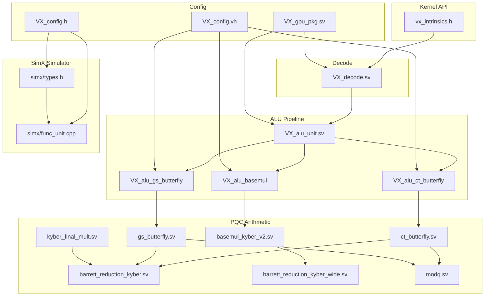

# Architecture — Kyber PQC Integration in Vortex

## Overview

The Kyber PQC integration adds three dedicated processing elements (PEs) to the Vortex GPGPU ALU pipeline to accelerate the polynomial arithmetic required by the CRYSTALS-Kyber key-encapsulation mechanism. These PEs operate as standard ALU sub-units, receiving dispatched instructions through the existing Vortex pipeline infrastructure and returning results through the standard commit path.

---

## Full Integration Stack

```
┌────────────────────────────────────────────────────────────────────┐
│                  KERNEL SPACE                                      │
│  ┌────────────────────────────────────────────────┐                │
│  │ vx_intrinsics.h                                │                │
│  │   vx_ct_butterfly(a,b,w)  → .insn r4 (func2=0) │                │
│  │   vx_gs_butterfly(a,b,w)  → .insn r4 (func2=1) │                │
│  │   vx_basemul(a,b,zeta)    → .insn r4 (func2=2) │                │
│  └────────────────────────────────────────────────┘                │
├────────────────────────────────────────────────────────────────────┤
│                 HARDWARE (RTL)                                     │
│                                                                    │
│  Fetch ──▶ Decode ──▶ Dispatch ──▶ Issue ──▶ Execute ──▶ Commit │
│              │                                                     │
│          VX_decode.sv                                              │
│          funct2 maps to:                                           │
│           00 → INST_ALU_CT_BF                                      │
│           01 → INST_ALU_GS_BF                                      │
│           10 → INST_ALU_BASEMUL                                    │
│              │                                                     │
│              ▼                                                     │
│         VX_alu_unit.sv                                             │
│         ┌──────────────────────────┐                               │
│         │ pe_switch                │                               │
│         │  ├─ PE_IDX_INT    (0)    │                               │
│         │  ├─ PE_IDX_MDV    (1)    │                               │
│         │  ├─ PE_IDX_CTBF   (2)    │                               │
│         │  ├─ PE_IDX_GSBF   (3)    │                               │
│         │  └─ PE_IDX_BASEMUL(4)    │                               │
│         └──────────┬───────────────┘                               │
│                    │                                               │
│         ┌──────────┴───────────┐                                   │
│         │  PQC Arithmetic      │                                   │
│         │  ┌─────────────────┐ │                                   │
│         │  │ ct_butterfly    │ │ (A+BW, A-BW) mod q                │
│         │  │ gs_butterfly    │ │ (A+B, (A-B)W) mod q               │
│         │  │ basemul_kyber   │ │ C0=A0B0+A1B1ζ, C1=...             │
│         │  │ barrett_red     │ │ 24-bit → 12-bit                   │
│         │  │ barrett_wide    │ │ 36-bit → 12-bit                   │
│         │  │ kyber_final_mult│ │ ×3303 mod q                       │
│         │  │ modq            │ │ [-q,2q) → [0,q-1]                 │
│         │  └─────────────────┘ │                                   │
│         └──────────────────────┘                                   │
├────────────────────────────────────────────────────────────────────┤
│               SIMULATION (SimX)                                    │
│                                                                    │
│  types.h        func_unit.cpp                                      │
│  AluType::CT_BF  → delay = LATENCY_CT_BF = 2                       │
│  AluType::GS_BF  → delay = LATENCY_GS_BF = 2                       │
│  AluType::BASEMUL→ delay = LATENCY_BASEMUL = 3                     │
└────────────────────────────────────────────────────────────────────┘
```

---

## Vortex Pipeline Architecture (Simplified)

```
  Fetch → Decode → Dispatch → Issue → Execute → Commit
                                         │
                                   ┌─────┴──────┐
                                   │  ALU Unit  │
                                   │  ┌───────┐ │
                                   │  │  INT  │ │
                                   │  ├───────┤ │
                                   │  │ MULDIV│ │
                                   │  ├───────┤ │
                                   │  │CT_BF  │◄── NTT Butterfly (Kyber)
                                   │  ├───────┤ │
                                   │  │GS_BF  │◄── INTT Butterfly (Kyber)
                                   │  ├───────┤ │
                                   │  │BASEMUL│◄── Base Multiply (Kyber)
                                   │  └───────┘ │
                                   └─────┬──────┘
                                         │
                                    ┌────┴────┐
                                    │  Commit │
                                    └─────────┘
```

The three Kyber PEs are added alongside the existing integer ALU (`VX_alu_int`) and multiply-divide unit (`VX_alu_muldiv`). All PEs share the same dispatch and commit interfaces.

---

## Integration Points

The Kyber integration touches these specific points in the Vortex architecture:

### 1. Instruction Encoding (R4-type custom-0)

```
31   27 26   25 24     20 19     15 14  12 11      7 6           0
┌──────┬───────┬─────────┬─────────┬──────┬─────────┬─────────────┐
│ rs3  │funct2 │  rs2    │  rs1    │funct3│   rd    │ INST_EXT1   │
│      │[26:25]│         │         │=000  │         │  7'b0001011 │
└──────┴───────┴─────────┴─────────┴──────┴─────────┴─────────────┘
```

| funct2 | Instruction | funct3 |
|--------|-------------|--------|
| 00 | CT Butterfly | 000 |
| 01 | GS Butterfly | 000 |
| 10 | Base Multiply | 000 |

### 2. Decode Stage (VX_decode.sv)

PQC instructions are decoded in the `INST_EXT1` (custom-0) case. When `funct3=000` and `funct2 ≤ 2`:

```systemverilog
ex_type = EX_ALU;                         // Route to ALU
op_args.alu.use_imm = 0;                  // Register-only
case (funct2)
    2'b00: begin
        op_type = INST_ALU_CT_BF;        // NTT butterfly
        op_args.alu.xtype = ALU_TYPE_ARITH;
    end
    2'b01: begin
        op_type = INST_ALU_GS_BF;        // INTT butterfly
        op_args.alu.xtype = ALU_TYPE_ARITH;
    end
    2'b10: begin
        op_type = INST_ALU_BASEMUL;      // Base multiply
        op_args.alu.xtype = ALU_TYPE_OTHER;  // Multi-cycle, wide Barrett
    end
endcase
```

Note: CT_BF and GS_BF use `ALU_TYPE_ARITH` while BASEMUL uses `ALU_TYPE_OTHER` to reflect its longer pipeline and different resource requirements.

### 3. ALU Routing (VX_alu_unit.sv)

The ALU routing logic selects the target PE based on `op_type`:

PE indices are computed relative to `EXT_M_ENABLED` (see `VX_alu_unit.sv` lines 35-39). The table below assumes `EXT_M_ENABLED=1` (M-extension present):

| PE Index | PE Name | Opcode Trigger |
|----------|---------|---------------|
| 0 | `PE_IDX_INT` | Standard ALU ops |
| 1 | `PE_IDX_MDV` | Multiply/divide ops (skipped if `EXT_M_ENABLED=0`) |
| **2** | **`PE_IDX_CTBF`** | **INST_ALU_CT_BF** |
| **3** | **`PE_IDX_GSBF`** | **INST_ALU_GS_BF** |
| **4** | **`PE_IDX_BASEMUL`** | **INST_ALU_BASEMUL** |

### 4. Configuration Parameters

| Parameter | File | Value | Used By |
|-----------|------|-------|---------|
| `LATENCY_CT_BF` | `VX_config.vh` / `VX_config.h` | 2 | `VX_alu_ct_butterfly.sv` + func_unit.cpp |
| `LATENCY_GS_BF` | `VX_config.vh` / `VX_config.h` | 2 | `VX_alu_gs_butterfly.sv` + func_unit.cpp |
| `LATENCY_BASEMUL` | `VX_config.vh` / `VX_config.h` | 3 | `VX_alu_basemul.sv` + func_unit.cpp |

### 5. Kernel Intrinsic API (vx_intrinsics.h)

Three inline functions wrap the R4-type assembly for use in GPU kernel code:

```c
int r = vx_ct_butterfly(A, B, W);  // NTT butterfly
int r = vx_gs_butterfly(A, B, W);  // INTT butterfly
int r = vx_basemul(packed_AB, packed_AB, zeta);  // Base multiply
// Result: upper 16 bits = first output, lower 16 bits = second output
```

### 6. SimX Simulation (types.h, func_unit.cpp)

The SimX cycle-approximate simulator mirrors RTL timing:

```cpp
AluType::CT_BF   → delay = LATENCY_CT_BF   = 2
AluType::GS_BF   → delay = LATENCY_GS_BF   = 2
AluType::BASEMUL → delay = LATENCY_BASEMUL = 3
```

---

## Instruction Lifecycle (Complete Flow)

```
Kernel: r = vx_ct_butterfly(A, B, W);
  │
  ▼
Compilation: .insn r4 0x0B, 0, 0, x3, x10, x11, x12
  │
  ▼
Fetch → Decode (VX_decode.sv):
  opcode=INST_EXT1, funct3=000, funct2=00
  → ex_type=EX_ALU, op_type=INST_ALU_CT_BF
  → reads rs1(A), rs2(B), rs3(W)
  │
  ▼
Dispatch → Issue → ALU (VX_alu_unit.sv):
  pe_select → PE_IDX_CTBF
  → VX_alu_ct_butterfly → ct_butterfly
  │
  ▼
Execute (2 cycles):
  Cycle 1: product = B·W mod q (Barrett)
  Cycle 2: A' = A+prod mod q, B' = A-prod mod q (modq)
  │
  ▼
Commit: rd = {A'[15:0], B'[15:0]}
```

---

## Design Philosophy

### 1. Minimal Pipeline Disruption

The Kyber PEs use the **existing Vortex pipeline infrastructure**:
- Standard `VX_execute_if` / `VX_result_if` interfaces
- Standard `VX_pe_serializer` for pipeline alignment
- Standard commit path with no special handling

### 2. Hardware-Software Contract

Follows RISC-V custom extension conventions:
- Instructions use the `INST_EXT1` opcode space
- Register operands for all inputs (no custom state)
- Results written to the general-purpose register file
- No special CSRs or memory-mapped interfaces needed

### 3. Modular Arithmetic Isolation

All Kyber-specific modular arithmetic is encapsulated in `hw/rtl/pqc/`, keeping the core ALU pipeline clean of PQC-specific logic.

### 4. SimX ↔ RTL Parity

The SimX simulator mirrors the exact latency values from the RTL configuration, ensuring cycle-accurate functional simulation of PQC operations.

---

## Complete Dependency Graph


