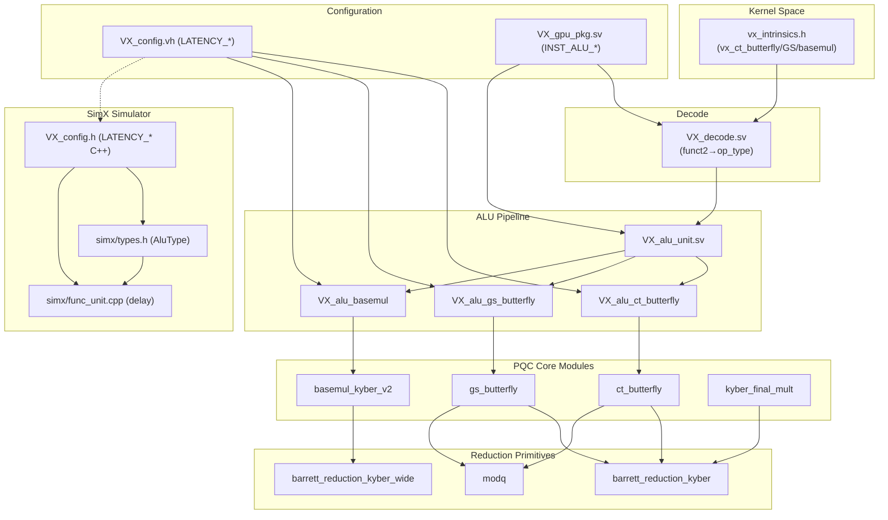

# Dependency Graph — Kyber PQC Integration

## Module Dependency Diagram



## Dependency Table

| Module | Depends On | Used By |
|--------|-----------|---------|
| `barrett_reduction_kyber` | — | `ct_butterfly`, `gs_butterfly`, `kyber_final_mult` |
| `barrett_reduction_kyber_wide` | — | `basemul_kyber_v2` |
| `modq` | — | `ct_butterfly`, `gs_butterfly` |
| `ct_butterfly` | `barrett_reduction_kyber`, `modq` | `VX_alu_ct_butterfly` |
| `gs_butterfly` | `barrett_reduction_kyber`, `modq` | `VX_alu_gs_butterfly` |
| `basemul_kyber_v2` | `barrett_reduction_kyber_wide` | `VX_alu_basemul` |
| `kyber_final_mult` | `barrett_reduction_kyber` | Standalone (part of PQC lib) |
| `VX_alu_ct_butterfly` | `ct_butterfly`, `VX_config.vh` | `VX_alu_unit` |
| `VX_alu_gs_butterfly` | `gs_butterfly`, `VX_config.vh` | `VX_alu_unit` |
| `VX_alu_basemul` | `basemul_kyber_v2`, `VX_config.vh` | `VX_alu_unit` |
| `VX_config.vh` | — | PE wrappers, PE delay |
| `VX_config.h` | — | `types.h`, `func_unit.cpp` |
| `VX_gpu_pkg.sv` | — | `VX_decode.sv`, `VX_alu_unit` |
| `VX_decode.sv` | `VX_gpu_pkg.sv` | Vortex decode stage |
| `VX_alu_unit` | All 3 PE wrappers, `VX_gpu_pkg.sv` | Vortex pipeline |
| `types.h` | `VX_config.h` | `func_unit.cpp` |
| `func_unit.cpp` | `types.h`, `VX_config.h` | SimX simulation |
| `vx_intrinsics.h` | — | GPU kernel code |

## Full Hierarchical View

```
Kernel Space
└── vx_intrinsics.h (vx_ct_butterfly, vx_gs_butterfly, vx_basemul)
    │
    ▼
Decode Stage
└── VX_decode.sv (funct2 decode → INST_ALU_CT_BF/GS_BF/BASEMUL)
    │
    ▼
ALU Pipeline
└── VX_alu_unit
    ├── VX_alu_ct_butterfly
    │   └── ct_butterfly
    │       ├── barrett_reduction_kyber
    │       └── modq
    ├── VX_alu_gs_butterfly
    │   └── gs_butterfly
    │       ├── barrett_reduction_kyber
    │       └── modq
    └── VX_alu_basemul
        └── basemul_kyber_v2
            └── barrett_reduction_kyber_wide

Configuration
├── VX_config.vh (Verilog) → PE wrappers
├── VX_config.h (C++) → SimX
└── VX_gpu_pkg.sv → Decode + ALU Unit

SimX Simulation
├── types.h (AluType enum)
└── func_unit.cpp (delay computation)
```

There are no circular dependencies. The dependency graph is a DAG rooted at `vx_intrinsics.h` (kernel) and `VX_decode.sv` (hardware), with leaf nodes being the primitive modules (`barrett_reduction_kyber`, `barrett_reduction_kyber_wide`, `modq`).
